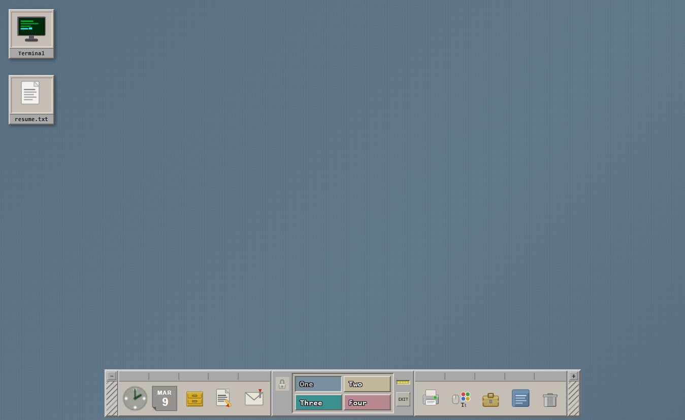
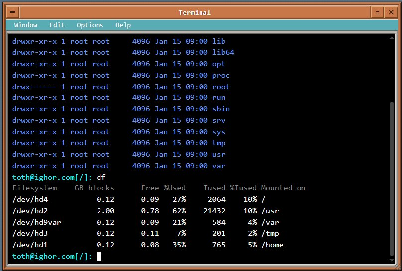
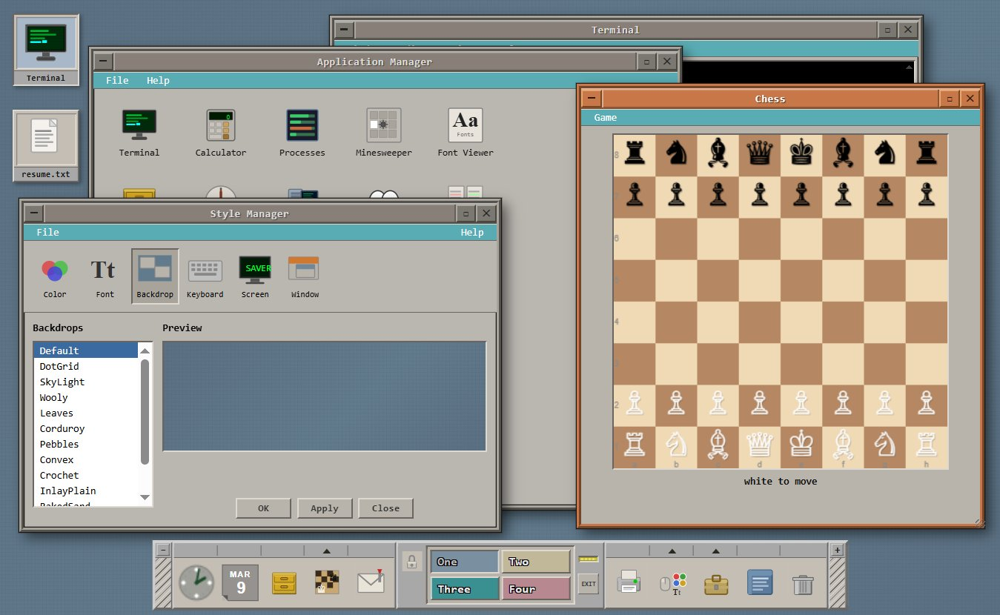

# CDE / Motif Desktop — Pure HTML

> A faithful recreation of the classic **CDE (Common Desktop Environment) / Motif** look and feel,
> built entirely in a **single HTML file** — no frameworks, no build tools, no dependencies.

> **⚠️ Disclaimer:** This is a hobby / fun project, not an official CDE emulator or
> a pixel-perfect reproduction. Some behaviours are simplified, invented, or just
> wrong compared to real CDE/Motif — and that's fine. The goal is the vibe, not
> the spec. Contributions that improve accuracy are welcome, but so are ones that
> just add something cool.

---

## 🌐 Live Demo

**[Try it in your browser →](https://igtoth.github.io/cde-motif-desktop/)**

No installation. No download. Just open and use.

> **How to enable after forking:**
> Repo → `Settings` → `Pages` → Source: **Deploy from branch** → `main` → `/ (root)` → **Save**
>
> GitHub publishes your `index.html` live at `https://igtoth.github.io/cde-motif-desktop/` — same file, zero build step.

---

## Screenshots

### Desktop


The authentic CDE teal-gray desktop (`#617a8c`) with subtle dot-grid texture, Motif-style beveled desktop icons, and the draggable Front Panel at the bottom — complete with analog clock, date, workspace switcher, and application launchers.

### Terminal


A fully functional terminal emulator running inside a Motif window — orange titlebar when focused, teal menu bar, black background with white/cyan output. Supports `ls -la`, `df`, `cd`, `cat`, `vi`, `ps`, `sudo`, and many more commands against a simulated Debian-like virtual filesystem.

### Multiple Windows — Chess, Style Manager, App Manager


Several windows open simultaneously: the **Chess** game (playable, with minimax AI), the **Style Manager** (change desktop backdrop, fonts, titlebar colors), and the **Application Manager** showing available apps. Windows stack, focus, and resize exactly like real Motif/mwm.

---

## Why a single file?

Most "desktop in the browser" projects require Node.js, a bundler, a dev server, npm install, and five config files before you see anything.

This project has one rule: **it must work by double-clicking `index.html`.**

That constraint is intentional:
- Zero setup — open and it works, even from a USB stick
- Easy to share — one file attachment, one `curl`, one `wget`
- Easy to fork and modify — no build pipeline to understand
- Works offline, on air-gapped machines, in restricted environments

Splitting into separate CSS/JS files would break `file://` loading due to browser CORS restrictions, removing the whole point.

---

## ✨ What's inside

### 🖥️ Desktop & Window Manager
- Authentic CDE teal-gray desktop (`#617a8c`) with subtle grid texture
- Draggable, resizable windows with Motif 3D beveled frames
- Orange titlebar on focused window, slate-gray on inactive — exactly like real CDE
- Window menu (minimize, maximize, close) via titlebar button
- Right-click context menu on windows and desktop
- Windows stack correctly with z-index focus management

### 📋 Front Panel (Taskbar)
- Draggable — grab the hatch-texture endcaps and move it anywhere on screen
- Collapsible with the `−` / `+` endcap buttons
- **Analog clock** — canvas-drawn, updates every second
- **HDD LED** — blinks yellow during "disk activity"
- **4-workspace switcher** — color-coded buttons (One/Two/Three/Four)
- Application launch buttons with tooltips
- Trash button

### 💻 Terminal Emulator
Functional shell with a simulated Debian-like environment:

| Command | Notes |
|---|---|
| `ls`, `ls -la`, `ls -l` | Lists directory with permissions, sizes, dates |
| `cd`, `cd ..`, `cd ~` | Navigate the virtual filesystem |
| `cat` | Print file contents |
| `pwd` | Current directory |
| `mkdir`, `touch`, `rm`, `rmdir` | Filesystem operations (in-memory) |
| `cp`, `mv` | Copy and move files |
| `echo` | Print text, supports `>` and `>>` redirection |
| `grep` | Search file contents |
| `find` | Search filesystem |
| `vi` / `vim` | Opens the built-in text editor |
| `ps`, `ps aux` | Process list |
| `top` / `htop` | Live-ish process viewer |
| `env`, `export`, `printenv` | Environment variables |
| `whoami`, `id`, `hostname`, `uname` | System info |
| `df`, `du` | Disk usage |
| `ping` | Simulated network ping |
| `curl` | Simulated HTTP requests |
| `ssh` | Simulated SSH connection |
| `sudo` | With password prompt |
| `tar`, `gzip` | Archive operations (simulated) |
| `chmod`, `chown` | Permission changes |
| `stat`, `file` | File metadata |
| `history` | Command history (↑/↓ arrows work) |
| `clear` | Clear terminal |
| `man` | Manual pages for common commands |
| `date` | Current date/time |
| `fortune` | Random fortune cookie |
| `matrix` | Surprise |

Tab completion and command history (↑/↓) are supported.

### 📁 File Manager
- Navigable virtual filesystem mirroring a real Debian `/` hierarchy
- Icon view and list view toggle
- Breadcrumb navigation bar with Back / Forward / Up buttons
- Double-click folders to navigate, files to open
- Status bar shows item count and selection
- Simulated hidden files (`.bashrc`, `.ssh`, etc.)

### 📝 Text Editor (Notepad)
- Open files from the virtual filesystem
- Edit and save back (in-memory)
- Monospace font, scrollable

### ♟️ Chess
- Fully playable — click a piece, click a destination
- Legal move highlighting (green squares)
- AI opponent using minimax with alpha-beta pruning (depth 2)
- Check / checkmate / stalemate detection
- Pawn promotion (auto-queen)

### 🎨 Style Manager
- Change desktop background color and backdrop pattern
- Change titlebar gradient (CDE-authentic presets)
- Change terminal font family and size
- Live preview

### And also...
- **Browser** — simulated Netscape-style browser with fake URL bar
- **FTP Client** — dual-pane local/remote layout
- **IRC Client** — chat window with user list and bot responses
- **Application Manager** — launcher grid for all apps

---

## 🚀 Getting Started

**Option 1 — Just open it:**
```bash
git clone https://github.com/igtoth/cde-motif-desktop.git
open cde-motif-desktop/index.html      # macOS
xdg-open cde-motif-desktop/index.html  # Linux
start cde-motif-desktop/index.html     # Windows
```

**Option 2 — Serve locally:**
```bash
cd cde-motif-desktop
python3 -m http.server 8080
# open http://localhost:8080
```

**Option 3 — Live demo** via GitHub Pages (see top of this file)

---

## 🌍 Browser Compatibility

| Browser | Min version | Notes |
|---|---|---|
| Chrome / Chromium | 60+ | Fully supported |
| Firefox | 55+ | Fully supported |
| Safari | 11+ | Fully supported |
| Edge (Chromium) | 79+ | Fully supported |
| Opera | 47+ | Fully supported |
| Mobile Chrome / Safari | iOS 11+ / Android 8+ | Works, UI is desktop-sized |
| Internet Explorer | ❌ | Not supported |

The file uses standard ES6 (template literals, `const`/`let`, arrow functions),
CSS custom properties, CSS Grid, and Canvas 2D — all widely available since 2017.
No polyfills, no transpilation needed.

---

## 🗂️ Project Structure

```
cde-motif-desktop/
├── index.html            ← Everything. The whole desktop.
├── README.md
├── CONTRIBUTING.md
├── LICENSE               ← MIT
├── .gitignore
└── screenshots/
    ├── desktop.png
    ├── terminal.png
    └── apps.png
```

---

## 🎨 Customization

### CONFIG block — personal settings

At the top of the `<script>` section there is a small `CONFIG` object.
It is the **only thing you need to edit** to make the desktop yours:

```javascript
const CONFIG = {
  USERNAME  : 'user',          // your shell username  e.g. 'alice'
  HOSTNAME  : 'cde-desktop',   // your machine name    e.g. 'mymachine'
  FULL_NAME : 'CDE User',      // shown in /etc/passwd and About

  MOTD: [
    // Lines printed when the terminal first opens.
    'CDE / Motif Desktop  —  pure HTML',
    '',
    'Type  help  to list available commands.',
  ],
};
```

Setting `USERNAME` and `HOSTNAME` automatically updates the shell prompt,
the virtual filesystem home directory, `/etc/passwd`, the browser tab title,
and a few other places — no need to search the file.

Everything else (colours, workspace names, panel layout) is faithful to the
original CDE/Motif aesthetic and is best left as-is, or changed interactively
via the built-in **Style Manager**.

### Adding Virtual Files

The virtual filesystem is a plain JS object (`const FS = { ... }`). Add any entry:

```javascript
'/home/user/notes.txt': {
  type: 'f',
  size: 64,
  date: 'Mar  9 12:00',
  perm: '-rw-r--r--',
  content: 'your content here'
},
```

Then add the filename to the parent directory's `children` array:
```javascript
'/home/user': { type:'d', children:['resume', 'notes.txt', 'mystery.c'], ... },
```

### Adding Terminal Commands

Find `handleCmd()` in the script section:

```javascript
if (cmd === 'hello') {
  tText('Hello, world!');
  renderPromptLine();
  return;
}
```

---

## 🧠 Architecture

```
index.html
├── <style>        ~900 lines  — CSS: Motif 3D system, layout, all components
├── <body>        ~1500 lines  — HTML: desktop, front panel, all window skeletons
└── <script>      ~5000 lines  — JS: window manager, terminal, virtual FS, apps
```

Key design decisions:
- **No shadow DOM** — windows are plain `<div>` elements, easy to inspect and modify
- **Virtual FS** — plain JS object, no backend needed
- **Canvas only where necessary** — clock and chess board; all UI is CSS
- **Stateless** — no localStorage, no cookies; every load is fresh (intentional)
- **Single file** — works from `file://`, USB, email attachment, pastebin

---

## 🏷️ Versioning

This project uses [Semantic Versioning](https://semver.org/).
The version lives in one place: `CONFIG.VERSION` at the top of `index.html`.

**To release a new version:**

```bash
# 1. Bump CONFIG.VERSION in index.html  e.g.  '1.0.0' → '1.1.0'
# 2. Add an entry to CHANGELOG.md
# 3. Commit, tag, and push

git add index.html CHANGELOG.md
git commit -m "chore: release v1.1.0"
git tag v1.1.0
git push origin main --tags
```

GitHub will show the tag as a release. The About window inside the desktop
automatically displays the version from `CONFIG.VERSION`, so it always
matches the git tag.

---

## 🤝 Contributing

See [CONTRIBUTING.md](CONTRIBUTING.md). All contributions welcome:

- New terminal commands
- Easter eggs in the virtual filesystem
- More apps (calculator, image viewer, calendar...)
- Better chess AI (increase depth, add openings book)
- Mobile / touch improvements
- Accessibility (keyboard navigation, ARIA)
- Authentic CDE fonts via `@font-face`

---

## 📜 License

MIT — see [LICENSE](LICENSE).

---

## 🙏 Acknowledgements

Inspired by the original **CDE (Common Desktop Environment)** and **Motif Window Manager (mwm)**,
as found on IRIX, Solaris, HP-UX, and Debian with the `cde` package.
Colors and geometry matched against reference screenshots of Debian 12.5 CDE.
